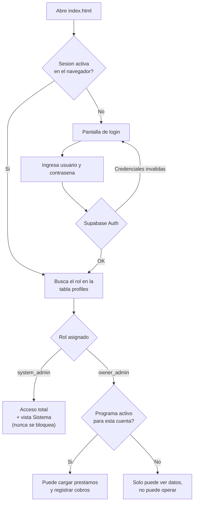
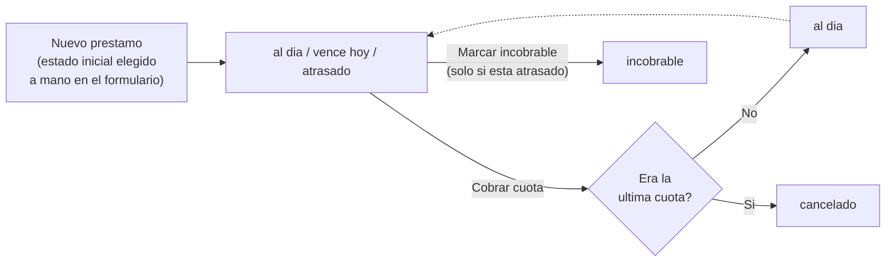
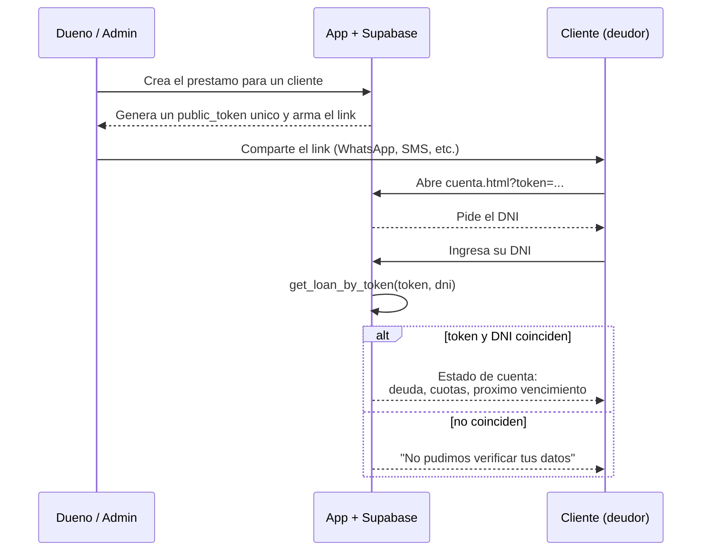

# Flujo operativo

Como se mueve la informacion en Credito Simple: quien hace que, y que le pasa a un prestamo desde que se crea hasta que se cierra.

## 1. Ingreso y roles

El "usuario" que se escribe en el login (`nicolas`, `duenio`) es solo una etiqueta corta para la UI: por debajo se traduce al email real de esa cuenta y se autentica contra Supabase Auth (`LOGIN_EMAILS` en `src/app.js`).

## 2. Ciclo de vida de un prestamo

**Importante:** el sistema no cambia el estado solo con el paso del tiempo. `al dia`, `vence hoy` y `atrasado` son valores que carga la persona que opera (al crear el prestamo, o de forma manual); lo unico que el sistema cambia automaticamente es el avance de cuotas al registrar un cobro, y el pase a `cancelado` cuando se paga la ultima. Calcular la mora automaticamente por fecha queda para una proxima etapa (ver `BACKEND.md`, Etapa 2).

## 3. Portal del deudor

El cliente nunca tiene una cuenta ni contrasena: el `token` del link mas su DNI son la unica llave. Sin el link no hay forma de encontrar ni listar prestamos de otra persona — no existe una vista publica que muestre todos los prestamos.
