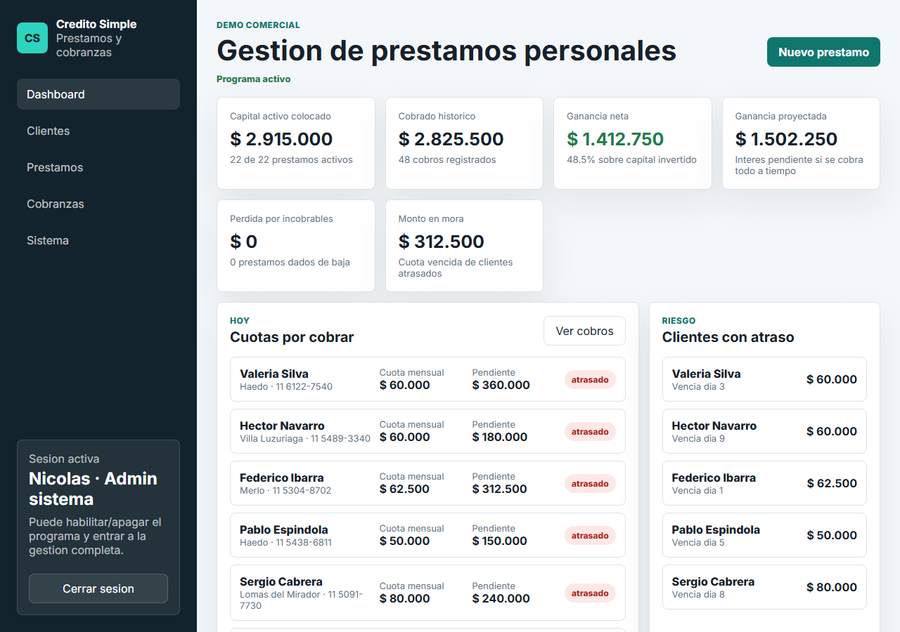
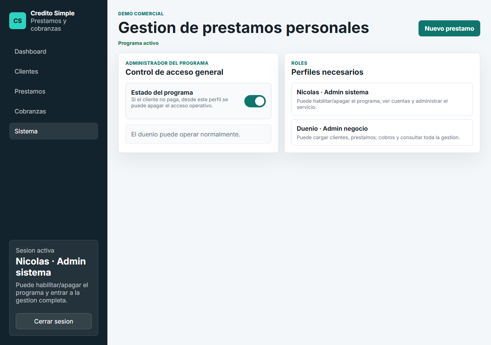
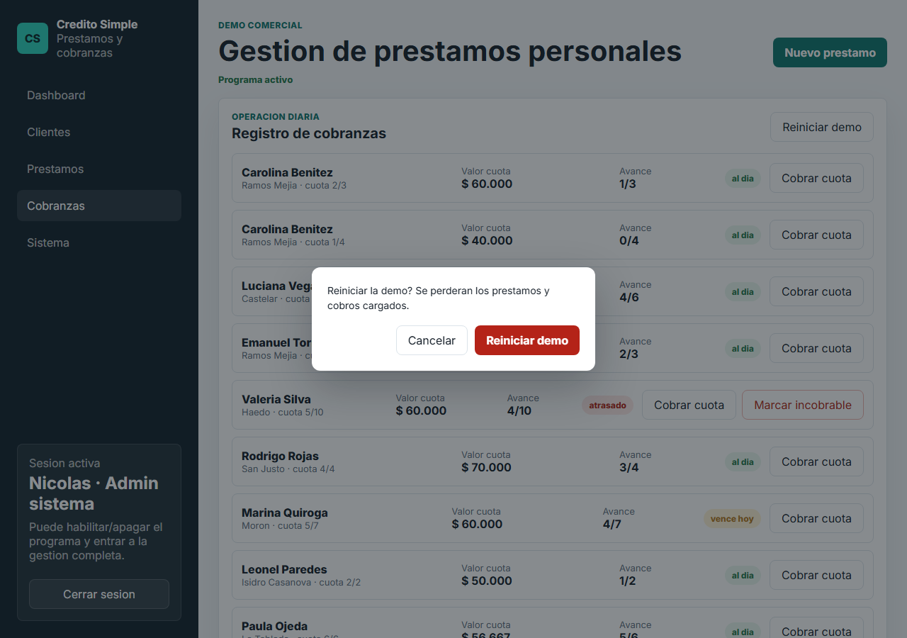
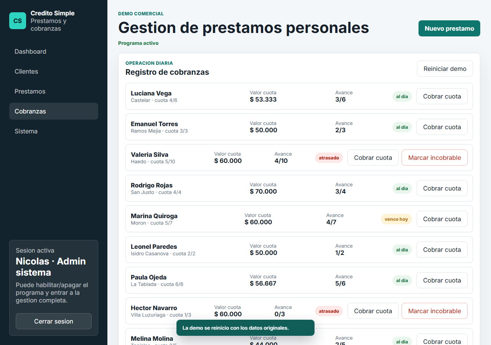

# Manual del administrador del sistema (Nicolas)

Guia para el perfil **system_admin**: quien administra el servicio en si (no un negocio puntual). Tiene todo lo que puede hacer el dueno, mas control sobre el acceso general y la base de datos.

> Para el dia a dia de cargar prestamos y cobrar, ver [`manual-operador.md`](./manual-operador.md) — todo eso tambien esta disponible con este perfil.

## 1. Ingresar al sistema

Mismo formulario de login que el dueno, con tu propio usuario. A diferencia del dueno, tu acceso **nunca se bloquea** aunque el programa este apagado.

## 2. Que se ve distinto respecto al dueno

Con este perfil aparece una pestana adicional, **Sistema**, tanto en el menu lateral como en el menu inferior (mobile).

## 3. Vista Sistema

### Activar / desactivar el programa

El switch "Estado del programa" es el control de acceso general: si lo apagas, el dueno deja de poder cargar prestamos o registrar cobros hasta que lo reactives (sigue viendo la informacion, solo se bloquea la operacion). Se usa, por ejemplo, si la cuenta del negocio tiene un pago pendiente con vos.

### Reiniciar la demo

Boton disponible en `Cobranzas` (solo visible para este perfil). Borra todos los prestamos y cobros cargados y vuelve a dejar los 20 clientes de ejemplo con su estado original. Pide confirmacion porque es una accion irreversible:

Al confirmar, se ve un aviso de que la demo volvio a su estado inicial:

Uso previsto: **solo para el entorno de demo/pruebas**, no para una cuenta con datos reales de un negocio — no hay forma de deshacerlo.

## 4. Lo que pasa del lado de Supabase

Este sistema no tiene panel de administracion propio para la base de datos: la gestion de usuarios y el esquema se hacen directamente en el dashboard de Supabase.

- **Estructura de datos y RLS**: definidas en `supabase/migrations/*.sql`. Correlas en orden (`0001`, `0002`, `0004`, ...) desde el SQL Editor del proyecto la primera vez que se configura una cuenta nueva. Ver `BACKEND.md` para el detalle de cada tabla.
- **Roles**: la tabla `profiles` define si un usuario es `system_admin` u `owner_admin`. Se asignan corriendo `0002_profiles.sql` (o un insert equivalente) despues de crear el usuario en Authentication.
- **Alta de un nuevo usuario**: se crea en el dashboard de Supabase, en `Authentication > Users` (con "Auto Confirm User" activado si no hay email transaccional configurado), y despues se le asigna el rol en `profiles`.
- **Portal del deudor**: cada prestamo tiene un `public_token` unico. La funcion `get_loan_by_token` es la unica forma de leer datos de un prestamo sin estar logueado, y exige que el DNI coincida. No hay una vista publica que liste prestamos.

## 5. Buenas practicas

- No compartas tu usuario ni contrasena de `system_admin` con el dueno del negocio: son perfiles con permisos distintos a proposito.
- Antes de desactivar el programa de una cuenta, avisale al dueno — se queda sin poder operar hasta que lo reactives.
- `Reiniciar demo` borra datos reales si se usa por error en una cuenta que no es de prueba. No tiene confirmacion doble mas alla del modal.
