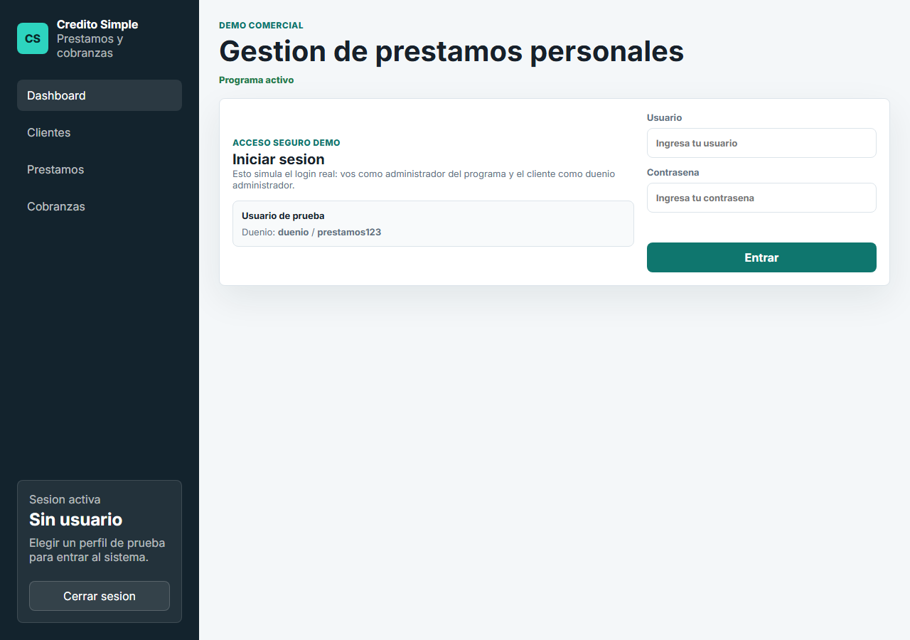
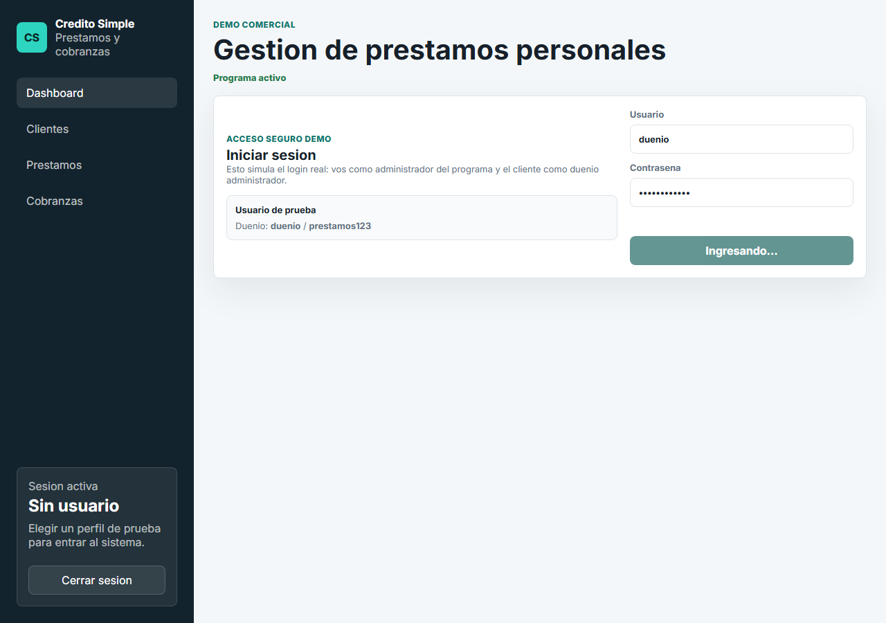
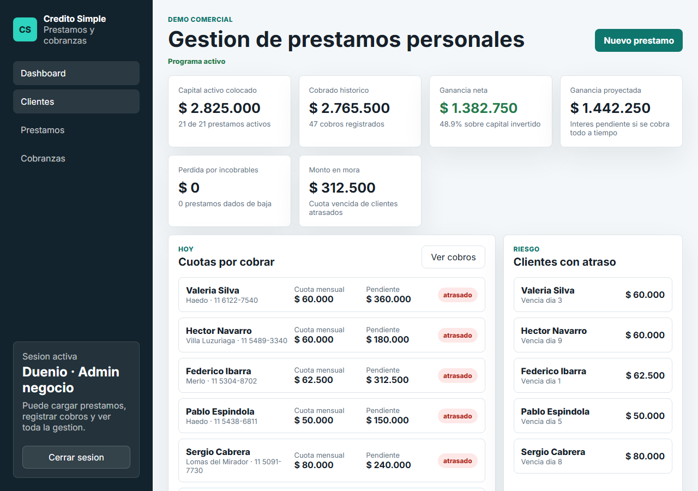
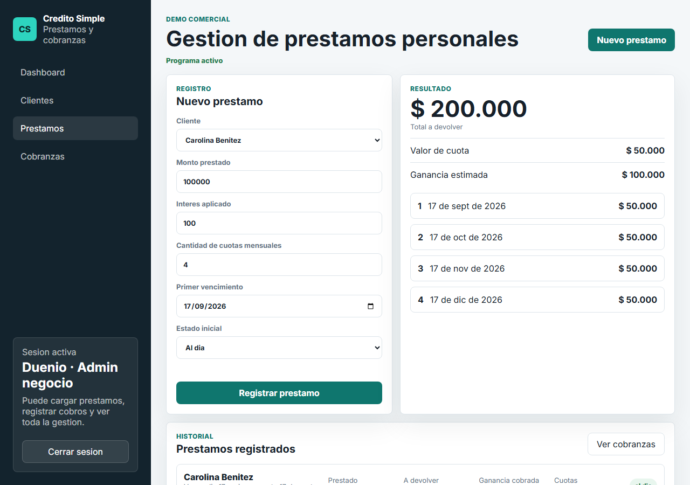
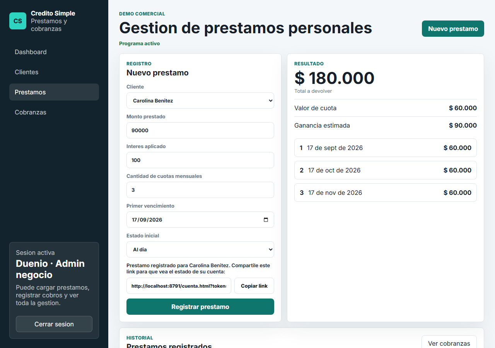
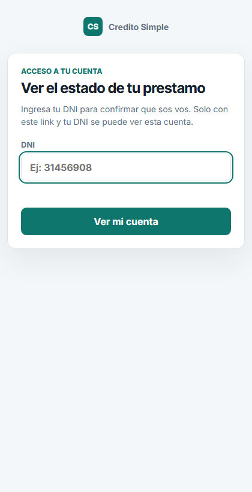
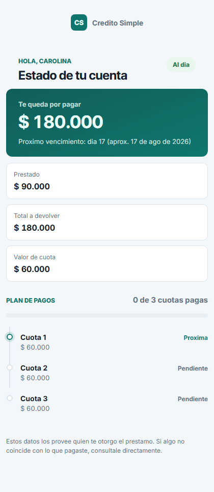
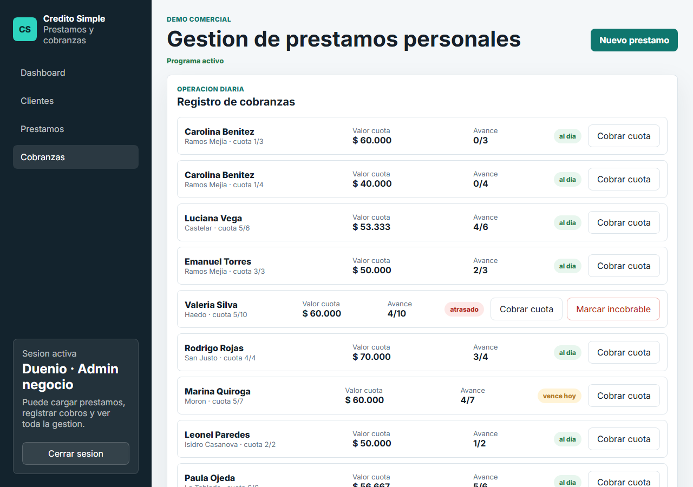
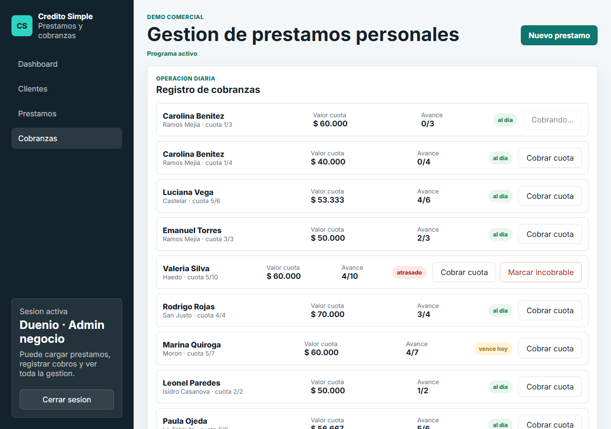
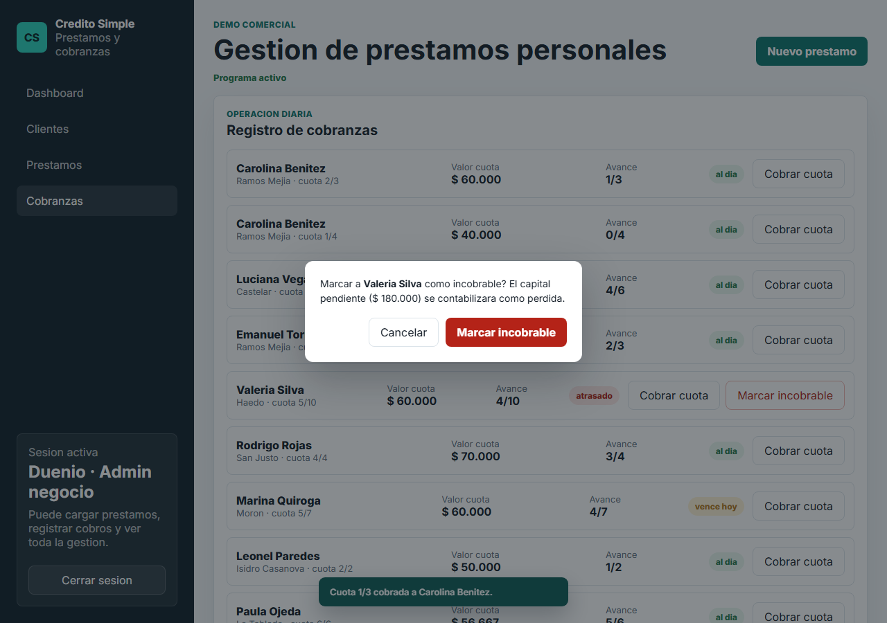

# Manual del dueño (Admin negocio)

Guia de uso de Credito Simple para el perfil **Duenio - Admin negocio**: la persona que carga clientes, otorga prestamos y registra cobros dia a dia.

> Para el perfil de Nicolas (administrador del sistema) ver [`manual-administrador.md`](./manual-administrador.md).

## 1. Ingresar al sistema

Entra con tu usuario y contrasena en la pantalla de acceso.

Si el administrador del sistema apago el programa, vas a ver un aviso al intentar entrar y no vas a poder operar hasta que lo reactive (ver seccion 6).

## 2. Dashboard

Al entrar ves el estado general del negocio: capital colocado, cobrado historico, ganancia neta y proyectada, perdida por incobrables, y monto en mora. Debajo, las cuotas por cobrar hoy y los clientes con atraso.

| Metrica | Que significa |
|---|---|
| Capital activo colocado | Suma del dinero prestado en los prestamos que siguen activos (no cancelados ni incobrables) |
| Cobrado historico | Total cobrado en todos los pagos registrados |
| Ganancia neta | Interes ya cobrado menos el capital perdido en incobrables, con el % que representa sobre el capital invertido |
| Ganancia proyectada | Interes que falta cobrar si todos los prestamos activos se pagan a tiempo |
| Perdida por incobrables | Capital que no se va a recuperar de los prestamos dados de baja |
| Monto en mora | Cuotas vencidas de clientes atrasados hoy |

## 3. Clientes

Lista completa de clientes cargados, con buscador por nombre, DNI o telefono.

## 4. Cargar un prestamo nuevo

Desde `Prestamos`, elegis un cliente ya existente, cargas monto, interes, cantidad de cuotas y la fecha del primer vencimiento. A la derecha se actualiza en vivo el total a devolver, el valor de cuota y el plan de pagos.

Al registrar el prestamo aparece un **link unico para el cliente**, listo para copiar y mandar por WhatsApp o donde prefieras.

## 5. El portal del cliente (deudor)

Ese link lleva a una pagina publica donde el cliente ve el estado de **ese** prestamo puntual. No necesita usuario ni contrasena: primero confirma su DNI.

Si el DNI coincide, ve cuanto le queda por pagar, el proximo vencimiento aproximado y el detalle de cada cuota (pagada, proxima o pendiente).

Si alguien abre el link sin el token correcto, o pone un DNI que no coincide, no ve ningun dato — ni de ese prestamo ni de ningun otro.

**Importante:** el link se muestra una sola vez, en el momento de crear el prestamo. Guardalo o enviaselo al cliente ahi mismo; el sistema no lo vuelve a mostrar despues.

## 6. Cobranzas

Ahi ves todos los prestamos con cuotas pendientes, con un boton para registrar el cobro de la proxima cuota.

Al cobrar una cuota aparece una confirmacion abajo a la derecha:

Si un cliente atrasado no va a pagar, podes marcar el prestamo como **incobrable**. El sistema pide confirmacion porque esto cuenta el capital pendiente como perdida en el dashboard:

Los prestamos incobrables quedan listados aparte, en la seccion "Prestamos incobrables" de la misma vista.

## 7. Si el programa aparece "apagado"

Es una funcion exclusiva de Nicolas (administrador del sistema): si tu cuenta tiene pagos pendientes, puede desactivar el acceso operativo hasta regularizar la situacion. Vas a poder ver la informacion pero no cargar prestamos ni registrar cobros. Contactalo para reactivarlo.
